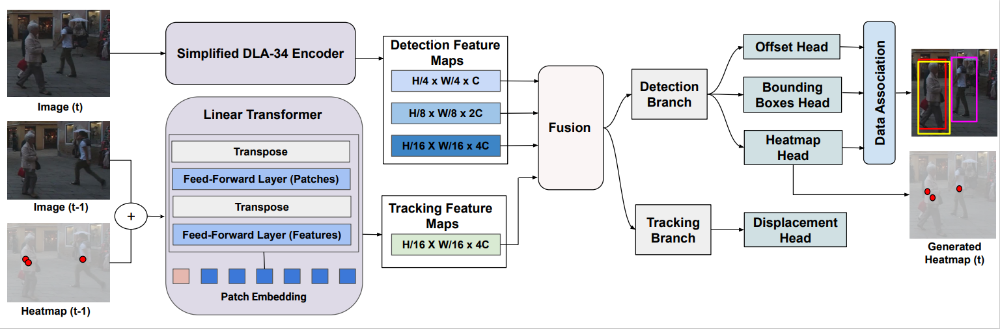

# LMOT: Efficient Light-Weight Detection and Tracking in Crowds

This repository is for a masters research project at Cairo University, computer engineering department.

This paper introduces [LMOT: Efficient Light-Weight Detection and Tracking in Crowds](https://doi.org/10.1109/ACCESS.2022.3197157) published in `IEEE access`. 

> [**LMOT: Efficient Light-Weight Detection and Tracking in Crowds**](https://doi.org/10.1109/ACCESS.2022.3197157),            
> RANA MOSTAFA, HODA BARAKA, AND ABDELMONIEM BAYOUMI

    @article{LMOT,
      author={Mostafa, Rana and Baraka, Hoda and Bayoumi, AbdElmoniem},
      journal={IEEE Access}, 
      title={LMOT: Efficient Light-Weight Detection and Tracking in Crowds}, 
      year={2022},
      doi={10.1109/ACCESS.2022.3197157}
    }

Contact: [Rana Mostafa](mailto:rana.abdelmohsen96@eng-st.cu.edu.eg), [AbdElMoniem Bayoumi](mailto:bayoumi@cu.edu.eg). Any questions or discussion are welcome! 

## Abstract
Multi-object tracking is a vital component in various robotics and computer vision applications. However, existing multi-object tracking techniques trade off computation runtime for tracking accuracy leading to challenges in deploying such pipelines in real-time applications. This paper introduces a novel real-time model, LMOT, i.e., Light-weight Multi-Object Tracker, that performs joint pedestrian detection and tracking. LMOT introduces a simplified DLA-34 encoder network to extract detection features for the current image that are computationally efficient. Furthermore, we generate efficient tracking features using a linear transformer for the prior image frame and its corresponding detection heatmap. After that, LMOT fuses both detection and tracking feature maps in a multi-layer scheme and performs a two-stage online data association relying on the Kalman filter to generate tracklets. We evaluated our model on the challenging real-world MOT16/17/20 datasets, showing LMOT significantly outperforms the state-of-the-art trackers concerning runtime while maintaining high robustness. LMOT is approximately ten times faster than state of-the-art trackers while being only 3.8% behind in performance accuracy on average leading to a much computationally lighter model.

## Main results

## Acknowledgement
The code is based on [xingyizhou/CenterNet](https://github.com/xingyizhou/CenterNet). Thanks for your wonderful works.
